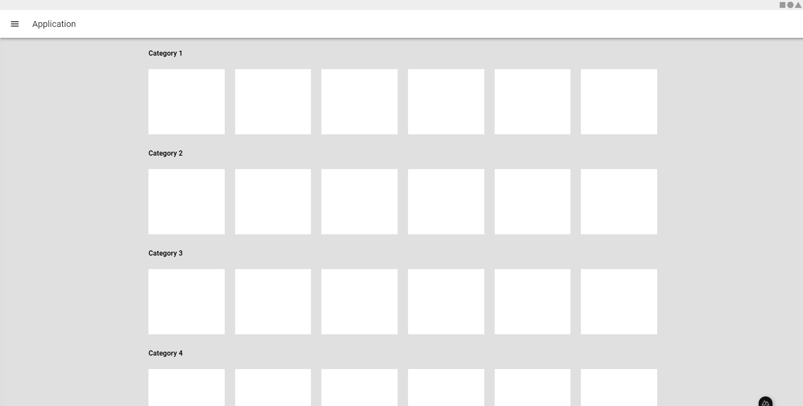
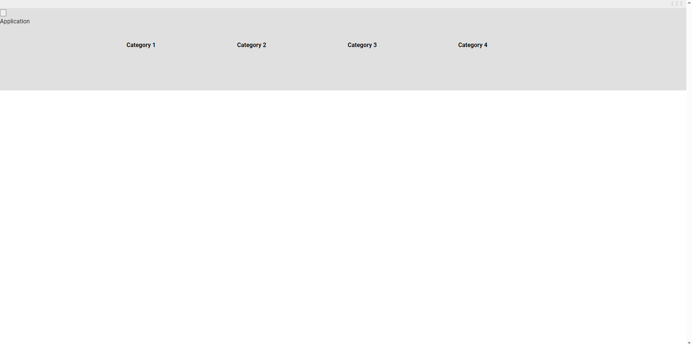

# 🧪 Vuetify 3 styles missing in the production build
This repository is for the reproduction of the following issue: https://github.com/Developmint/nuxt-purgecss/issues/187

## ✅ In dev mode the styles are correct

## ❌ In the production build Vuetify styles are not applied

### 👩🏻‍💻 Running this project in dev mode
1. Run `npm install`
2. Run `npm run dev`
3. Access the server in `http://localhost:3000`

### 🌟 Running this project for production
1. Run `npm run build`
2. Run `npm run preview`
3. Access the server in `http://localhost:3000`
